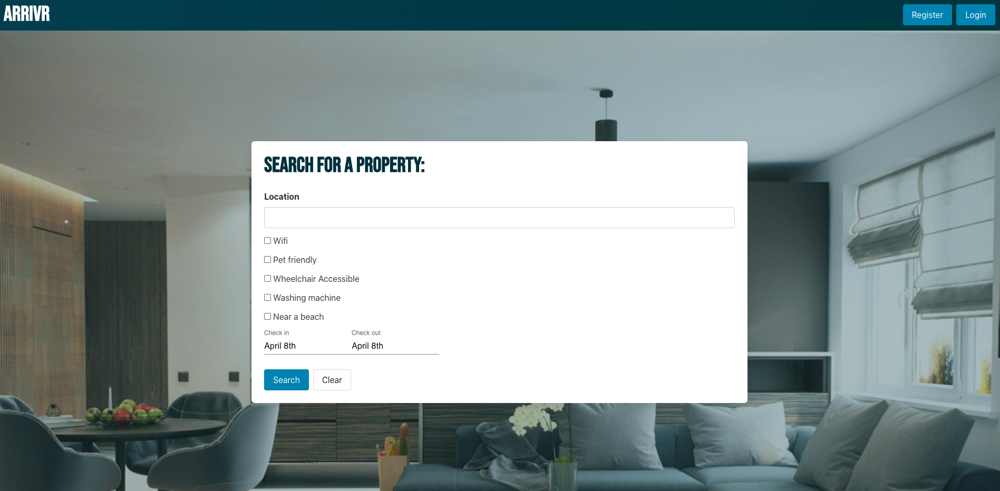
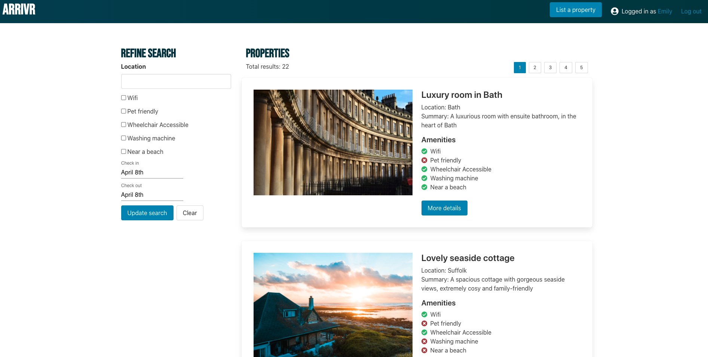
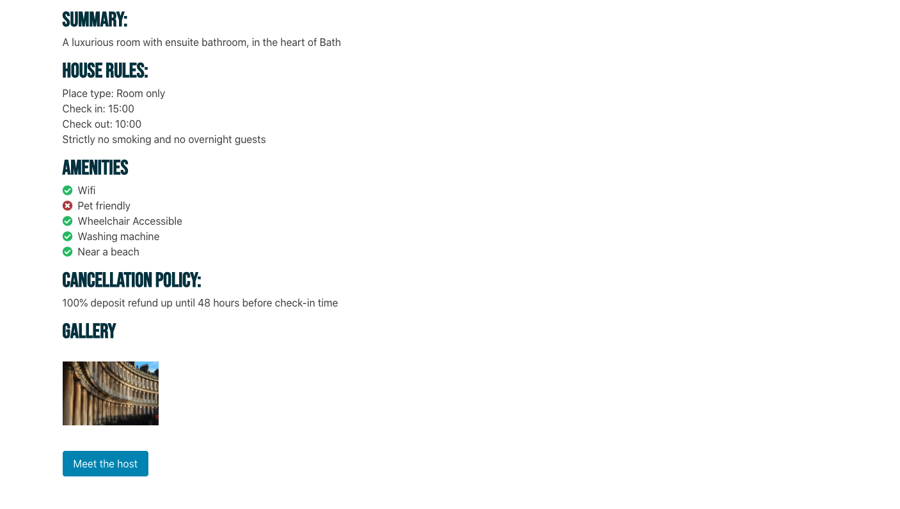
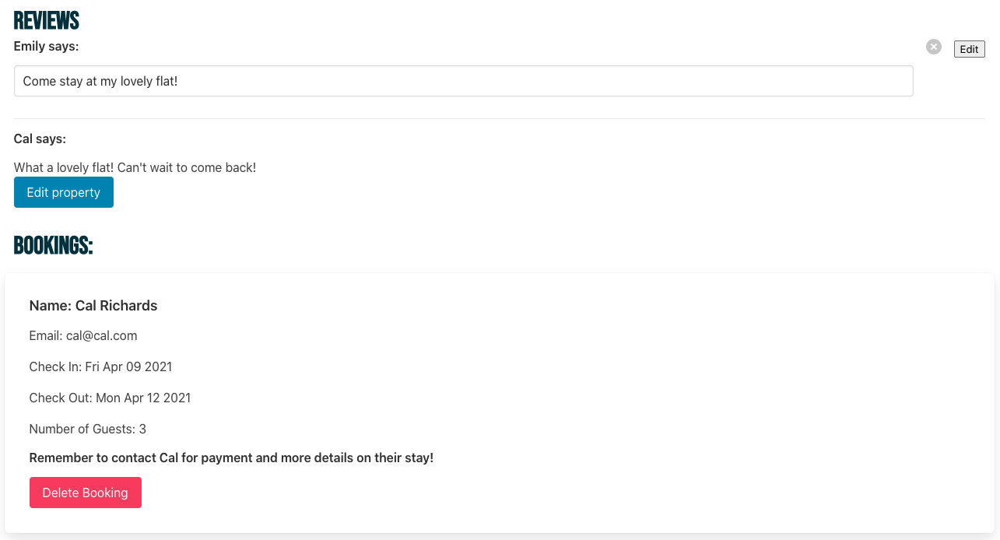
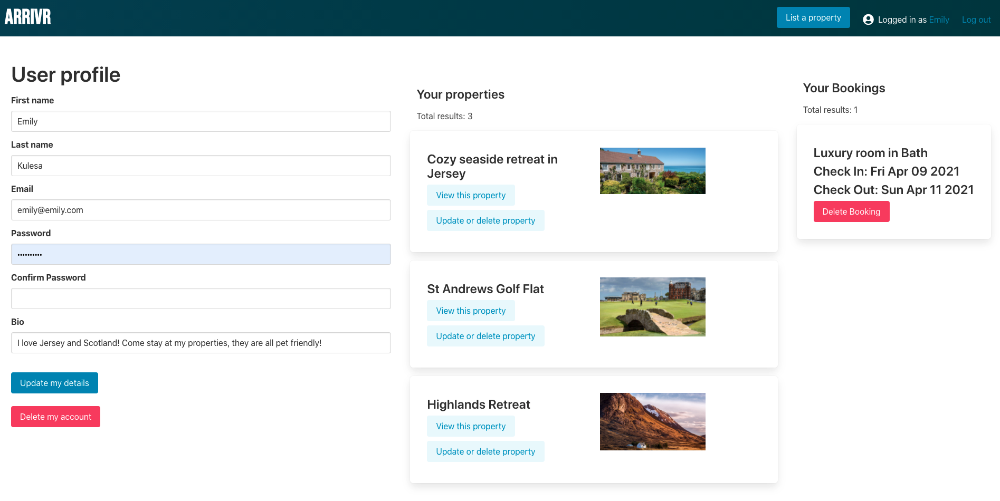

###  General Assembly, Software Engineering Immersive

# Arrivr

For Project 3, my group and I decided to create an AirBnb clone, where we created our own MongoDB database and linked it to a React frontend. Users can create an account, book  and list properties as well as leave reviews on places they stayed. My role focused on creating the backend, specifically the controllers in Express and formatting how users saw bookings and comments on the front end depending on if they are a host, guest or regular user. While there are many components to this project, I will discuss my responsibilities below. 

The project is deployed on Heroku which can be viewed here: https://arrivr-sei53.herokuapp.com/

You can log in and create an account, however, you may also use this log in to view the site as an established user:

*email*: emily@emily.com
*password*: passwords4

## Technologies Used
- HTML
- CSS
- React
- Bulma
- Express
- MongoDB
- Mongoose
- Npm
- Axios
- Insomnia
- Git
- Github

## Screenshots

Homepage


Search Page


Hero Property Image


Guest Property info view


Host Booking view with reviews


User Profile

## Technical Requirements
​
* Work in a team, using **git to code collaboratively**.
* **Build a full-stack application** by making your own backend and your own front-end
* **Use an Express API** to serve your data from a Mongo database
* **Consume your API with a separate front-end** built with React
* **Be a complete product** which most likely means multiple relationships and CRUD functionality for at least a couple of models
* **Implement thoughtful user stories/wireframes** that are significant enough to help you know which features are core MVP and which you can cut
* **Have a visually impressive design** to kick your portfolio up a notch and have something to wow future clients & employers. **ALLOW** time for this.
* **Be deployed online** so it's publicly accessible.

## Timeframe: 1 week (5 working days)
## Plan
We early on established that we wanted to work on something travel related. We also decided on the four main components of the website: users, properties, bookings, comments and reviews. 
## Database and Backend
A lot of my work focused on the backend. This included the creation of the database and the controllers to add, edit and delete data. Firstly, we started on the models, which created the base for our content. while the user model followed a standard template, the property model was much more complex. To accommodate the arrays of amenities, comments and bookings linked back to a property, we nested the data in the property model. 
```js
const propertiesSchema = new mongoose.Schema({
  name: { type: String, required: true, unique: true,
    validate: (name) => {
      return name.length > 1 
    }
  },
  location: { type: String, required: true, unique: false },
  images: { type: Array, required: true, unique: false },
  propertyType: { type: String, required: true, unique: false },
  pricePerNight: { type: Number, required: true, unique: false },
  summary: { type: String, required: true, unique: false },
  houseRules: { type: String, required: true, unique: false },
  cancellationPolicy: { type: String, required: true, unique: false },
  numberOfBedrooms: { type: Number, required: true, unique: false },
  maxNumberOfGuests: { type: Number, required: true, unique: false },
  checkInTime: { type: String, required: true, unique: false },
  checkOutTime: { type: String, required: true, unique: false },
  amenities: [amenitySchema],
  host: { type: mongoose.Schema.ObjectId, ref: 'User', required: true },
  comments: [commentSchema],
  bookings: [bookingSchema]
})
```
With the host data nested in the property component, when calling on data that would link back to a specific user, we could simple filter the property data based on the user id linked to it. This was the same logic for both the bookings and comments.

I spent most of my time on the backend creating the controllers for the components. The most important components focused on aspects of the website that would require user permissions. To ensure that this would only allow the specified user to post, edit or delete content, we created a secure route middleware file. This would establish the user's id and token as that of the current user to test if that id matched that of the owner of said content.
```js
import jwt from 'jsonwebtoken'

import User from '../models/users.js'
import { secret } from '../config/environment.js'

export default async function secureRoute(req, res, next) {
  try {
    console.log(req.params)

    const authToken = req.headers.authorization
    if (!authToken || !authToken.startsWith('Bearer')) {
      console.log('Unauthorized1')
      return res.status(401).send({ message: 'Unauthorized1' })
    }
    const token = authToken.replace('Bearer ', '')

    console.log('🤖' + ' ' + authToken)
    console.log('🤖' + ' ' + token)

  
    jwt.verify(token, secret, async (err, data) => {

      if (err) {
        console.log('Unauthorized2')
        return res.status(401).send({ message: 'Unauthorized2' })
      }

      const user = await User.findById(data.userId)
      console.log('SecureRoute user', user)

      if (!user) {
        console.log('Unauthorized3')
        return res.status(401).send({ message: 'Unauthorized3' })
      }

      req.currentUser = user
      next()
    })

  } catch (err) {
    console.log('Unauthorized4')
    res.status(401).send({ message: 'Unauthorized4' })
  }
}
```
I also worked on other bits of middleware, like the logger and the errorHandler. This allowed us to display error messages correctly and helped us debug as we were creating the project. 

Controllers
In many of the controllers we knew that editing and deleting content would require user validation. For this, I included logic to ensure only the correct user could have these permissions, as seen in the updateProperty example below.
```js
async function updateProperty(req, res, next) {
  const id = req.params.propertyId
  const currentUser = req.currentUser
  const body = req.body

  try {
    const propertyToUpdate = await Properties.findById(id).populate('host')
    if (!propertyToUpdate) {
      return res.send({ message: 'Oops, we didn\'t find any properties to update. Please try again' })
    }
    if (!propertyToUpdate.host._id.equals(currentUser._id)) {
      return res.status(401).send({ message: 'Unauthorized' })
    }
    
    propertyToUpdate.set(body)
    propertyToUpdate.save()

    res.send(propertyToUpdate)

  } catch (err) {
    next(err)
  }
}
```
The most difficult part of the controllers was linking the current user to the ownership of certain pieces of data.
Having multiple endpoints was important to our project as we wanted many ways for users to access data. However, we made the decision not to have backend filtering for the properties. We believe this would complicate filtering properties based on amenities and dates on the front end. However, we still wanted multiple endpoints for users to get bookings, comments and properties. To keep consistent, we had this filtering done at the front end. 
## Front End and Components
My work on the front end mainly consisted of the comments and viewing and deleting bookings.
From the beginning, we knew the comments had to be displayed differently based on the person viewing them.

Firstly, I included logic so if a person has not booked a property or is not the host, they can not post a comment on the property, with the useState for the updateError changing the statement to reflect the logic.

```js
async function handleComment() {
    updateError('')
    try {
      await axios.post(`/api/properties/${match.params.propertyId}/comment`, { text }, {
        headers: { Authorization: `Bearer ${token}` }
      })
        .then(resp => {
          setText('')
          updateProperties(resp.data)
          updateCommentSuccess(true)
          updateEditCommentSuccess(false)
        })
    } catch (err) {
      console.log(err)
      updateError('Sorry, only hosts and those who have booked a stay can leave a review!')
      updateCommentSuccess(false)
      updateEditCommentSuccess(false)
    }
  }
// Turnery error handling statements
 {error && <div className='box mt-4 has-background-danger has-text-white'>{error}</div>}
  
```
For how the user views the User views the comment, it depends on if they are the user who posted the comment or not. For this, we used a turnery to change how the comment is displayed. This also changes the logic for if the comment is displayed in a textbox with a delete and edit button.
```js
property.comments.map((comment, index) => {
              return <article key={index} className="media">
                <div className="media-content">
                  {isCreator(comment.user._id) && <div className="content">
                    <h6>{comment.user.first_name} says:</h6>
                    <input
                      className="input"
                      type='text'
                      name="textbox1"
                      defaultValue={comment.text}
                      onChange={event => setText(event.target.value)}
                    />
                  </div>}
                  {editCommentSuccess ? <div className="notification is-success is-light">Your review edit has been saved.</div> : <div className="notification is-hidden"></div>}
                  {!isCreator(comment.user._id) && <div className="content">
                    <h6>{comment.user.first_name} says:</h6>
                    <p>{comment.text}</p>
                  </div>}
                </div>
                {isCreator(comment.user._id) && <div className="media-right">
                  <button
                    className="delete"
                    onClick={() => handleDeleteComment(comment._id)}>
                  </button>
                </div>}
                {isCreator(comment.user._id) && <div className="media-right">
                  <button
                    className="edit"
                    onClick={() => handleUpdateComment(comment._id)}>Edit
                    </button>
                </div>}
              </article>
            })
```
To edit an delete reviews or comments, we used async functions with an axios request to put or delete the comment, as seen in the example below.
```js
async function handleUpdateComment(commentId) {
    try {
      await axios.put(`/api/properties/${match.params.propertyId}/comment/${commentId}`, { text }, {
        headers: { Authorization: `Bearer ${token}` }
      })
        .then(resp => {
          setText('')
          updateEditCommentSuccess(true)
          updateProperties(resp.data)
        })
    } catch (err) {
      updateEditCommentSuccess(false)
      
      console.log('error', err)
    }
  }
```
Each of the comment logic functions includes error handling, which displays success or error messaged based on if the function was called successfully or if there was an error or user permissions issue. 

```js
{errorState ? <div className="notification is-danger">We could not post your review. Please try again.</div> : <div className="notification is-hidden"></div>}
          {commentSuccess ? <div className="notification is-success is-light">Your review has been saved.</div> : <div className="notification is-hidden"></div>}
```
For displaying bookings, we decided that they should be different views for the user and the host. For the user, we created a component which would be displayed on the user's profile page. This would allow users to see the property booked, along with the dates of their check in and check out. Users could delete their booking from this point as well. We included the pagination component as well so if users had more then three bookings they could see them on multiple pages. Upon deletion, the user sees a Success box saying the booking has been cancelled.
```js
<div>
      {userBookings.slice((pageNum - 1) * resultsPerPage, ((pageNum - 1) * resultsPerPage) + resultsPerPage).map((item, index) => {
        return <div className='box columns mt-4' key={index}>
          <div className="column">
            <h4 className='title is-4 mb-2 mt-2'>{item.propertyName}</h4>
            <p className='title is-4 mb-2 mt-2'>Check In: {String(new Date(item.checkInDate)).substr(0,15)}</p>
            <p className='title is-4 mb-2 mt-2'>Check Out: {String(new Date(item.checkOutDate)).substr(0,15)}</p>
            <button className="button is-danger" onClick={(event) => {
              handleDeleteBooking(event, item)
            }}>Delete Booking</button>
          
          </div>
```
For hosts, we wanted a very different display of the bookings. While we considered adding another component to the User profile, to prevent it getting too crowded, we added this visibility onto each property profile page. In place of the booking component, hosts see a list of all bookings made ont the property. We decided to limit the amount of data the host saw to keep the page clean. Hosts can also delete the booking from this page, which then displays a success message saying the booking has been cancelled. 
```js
{isCreator(property.host._id) && <div className="content">
            <h5 className='title brandfont has-text-info is-size-3 mb-1 mt-4'>Bookings:</h5>
            {property.bookings.length > 0 &&
              property.bookings.map((booking, index) => {
                return <div key={index} className="box columns mt-4">
                  <div className="column">
                    <h5>Name: {booking.user.first_name} {booking.user.last_name}</h5>
                    <p>Email: {booking.user.email}</p>
                    <p>Check In: {String(new Date(booking.checkInDate)).substr(0, 15)}</p>
                    <p>Check Out: {String(new Date(booking.checkOutDate)).substr(0, 15)}</p>
                    <p>Number of Guests: {booking.numberOfGuests}</p>
                    <h6>Remember to contact {booking.user.first_name} for payment and more details on their stay!</h6>
                    <button className="button is-danger" onClick={(event, item) => {
                      handleDeleteBooking(event, item, booking._id)
                    }}>Delete Booking</button>
                    {deleteSuccessState ? <div className="notification is-success mt-3">Booking Successfully Deleted.</div> : <div className="notification is-hidden"></div>}
                  </div>
                </div>
              })
            }
          </div>}
```

In both cases, our group debated if the page should automatically reload upon deletion of a booking or if the success message once enough. We decided having the success alert was the best option, as if a user accidentally cancelled a booking, they could still see the details to rebook. 

## Bugs
- If you are the second person to comment on a property, it does not immediately appear unless the host has commented first.
- When editing a review/comment, the text appears in both the user textbox as well as the main textbox below the reviews.
## Lessons Learned
Working as a group was a new experience for all of us and I think it was beneficial to our learning. I enjoyed bouncing ideas off my teammates and helping them debug when they were stuck. If we were to tackle this project again, I don't believe we would change to much on the back end. On the frontend, I think some of our logic would change on how the properties are filtered and what page reloads or redirections were triggered by editing or deleting data.